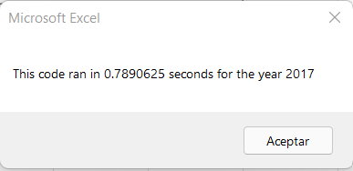
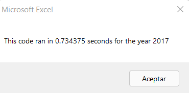
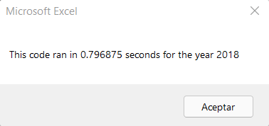
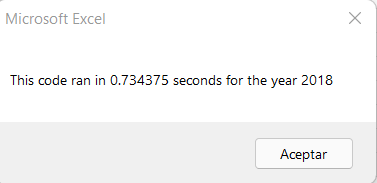

# stock-analysis

## Overview of Project

This project seeks to analyze a couple of green energy stocks based on their total daily volume and yearly return value in order to identify how actively each stock is traded and the difference in the ending price related to the starting price for stock data in 2017 and 2018. This information will help Steve(client) decide, based on the data, which green energy stocks are better to invest in. 

In addition it goes a step further by refactoring the initial code, which basically means making it more efficient. This second part of the project was done to make sure that the code can run faster even when more stock data was analyzed.

## Results
### 2017 Analysis
By refactoring the code, we managed to make it more efficient. For the 2017 analysis the run time decreased from 0.7890625 seconds to 0.734375 seconds. This  can be appreciated with the next images, the first image shows the original code run time and the second the run time using the refactored code. 

### 2018 Analysis

For the 2018 analysis, the initial time using the original code was of 0.796875. 

When running the refactored code the time decreased to 0.734375. 

## Summary

With this project we can conclude that some of the advantages of refactoring the code is that it indeed makes the code run faster, which can be benefitial in terms of time and money. However, it is time consuming to refactor a code, as it requieres of different attempts and creativity to come with a better or more effective solution. 

Regarding the refactoring of the original VBA script in this project, the advantage is that the time reduced for both years analysis(2017 and 2018). But it is not that significant. The main disadvantage of the refactored code is that it took a lot of time to make the new code work correctly, as many errors arised during the process.  

